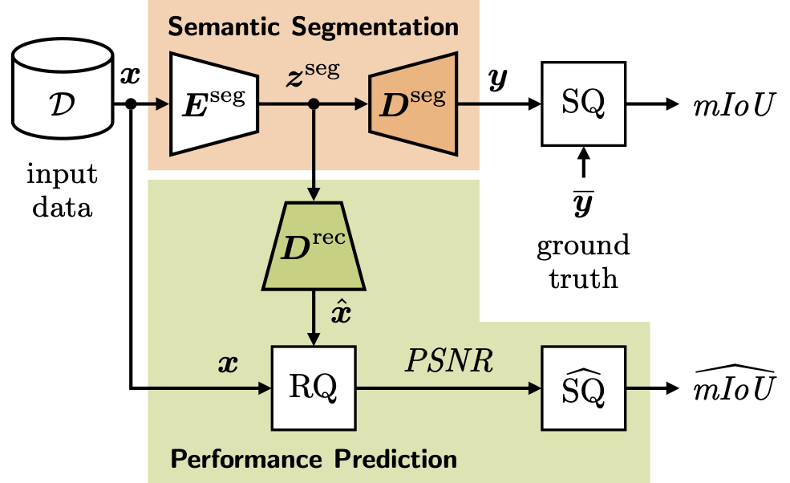

# Improvements to Image Reconstruction-Based Performance Prediction for Semantic Segmentation in Highly Automated Driving
[Andreas Bär](https://www.tu-braunschweig.de/en/ifn/institute/team/sv/baer), [Daniel Kusuma](https://github.com/ksmdnl) and [Tim Fingscheidt](https://www.tu-braunschweig.de/en/ifn/institute/team/sv/fingscheidt)

## Idea Behind the Paper
**System Overview**



In this work, we build upon 
the [Performance Prediction](https://openaccess.thecvf.com/content/CVPR2022W/WAD/papers/Bar_Performance_Prediction_for_Semantic_Segmentation_by_a_Self-Supervised_Image_Reconstruction_CVPRW_2022_paper.pdf) tool
 and propose several methods to reduce the prediction error.
In particular, we investigated three approaches to improve the predictive power.
Our investigations reveal that the best Pearson correlation between segmentation quality and reconstruction quality does not always lead to the best predictive power. Further, our best combination is able to surpass state of the art in image-only performance prediction on the Cityscapes and KITTI dataset.

## Citation
If you find our code helpful or interesting for your research, please consider citing
```
@InProceedings{Baer2022,
  author    = {Andreas Bär and Marvin Klingner and Jonas Löhdefink and Fabian Hüger and Peter Schlicht and Tim Fingscheidt},
  booktitle = {Proc. of CVPR - Workshops},
  title     = {{Performance Prediction for Semantic Segmentation and by a Self-Supervised Image Reconstruction Decoder}},
  year      = {2022},
  address   = {New Orleans, LA, USA},
  month     = jun,
  pages     = {4399--4408},
}
```
```
@InProceedings{Baer2023,
  author    = {Andreas Bär and Daniel Kusuma and Tim Fingscheidt},
  booktitle = {Proc. of CVPR - Workshops},
  title     = {{Improvements to Image Reconstruction-Based Performance Prediction for Semantic Segmentation in Highly Automated Driving}},
  year      = {2023},
  address   = {Vancouver, Canada,
  month     = jun,
  pages     = {4399--4408},
}
```

## Our Models
Results are reported for the Cityscapes Lindau validation set. Please refer to the paper for the results reported on the KITTI validation set.

SwiftNet-, Monodepth2-, and DeepLabv3+-based semantic segmentation baseline:

model | mIoU  | Download link |
------|-------|---------------|
RN18-SwiftNet| 65.02 | [model](https://drive.google.com/drive/folders/1m433jSb2A5AVXrEBE7UUMp79mkExhHn1?usp=share_link)     |
RN50-SwiftNet| 65.18 | [model](https://drive.google.com/drive/folders/1-spTAIv74z5enF78pT1ypAadrA30EtNG) |
SW-SwiftNet| 68.98 |[model](https://drive.google.com/drive/folders/1-spTAIv74z5enF78pT1ypAadrA30EtNG) |
CN-SwiftNet| 74.76 |[model](https://drive.google.com/drive/folders/1-spTAIv74z5enF78pT1ypAadrA30EtNG) |
-|-|-
RN18-Monodepth2| 60.52 | [model](https://drive.google.com/drive/folders/1kGBuV4xeAGahfEHOHlpek6C-PDRNSb0x) |
-|-|-
RN50-DeepLabV3+ | 64.18 | [model](https://drive.google.com/drive/folders/15CgYJZxSYAt1vfG5WcaN4OQ2krt52WXJ) |
SW-DeepLabV3+ | 64.65 | [model](https://drive.google.com/drive/folders/15CgYJZxSYAt1vfG5WcaN4OQ2krt52WXJ) |
CN-DeepLabV3+ | 69.02 | [model](https://drive.google.com/drive/folders/15CgYJZxSYAt1vfG5WcaN4OQ2krt52WXJ) |


The following tables include the Peason correlation coefficient, the absolute and the root mean squared prediction error as described in the paper.

The model weights with the lowest prediction errors as reported in the paper:

<!-- Add hyperparameter into the table:
- Delta_D in models from sup materials with *
- Under the table explain/mention the typo
 -->

<!-- | Decoder | Encoder  |  $\rho$ | $\Delta^{M}$ | $\Delta^{R}$ | $\rho$ | $\Delta^{M}$ | $\Delta^{R}$| Download link |
|---------|----------|--------|--------------|--------------|--------|--------------|-------------|---------------|
| RN-18   | SwiftNet |        |            ||||||| -->

<!-- <style type="text/css">
.tg  {border-collapse:collapse;border-spacing:0;}
.tg td{border-color:black;border-style:solid;border-width:1px;font-family:Arial, sans-serif;font-size:14px;
  overflow:hidden;padding:10px 5px;word-break:normal;}
.tg th{border-color:black;border-style:solid;border-width:1px;font-family:Arial, sans-serif;font-size:14px;
  font-weight:normal;overflow:hidden;padding:10px 5px;word-break:normal;}
.tg .tg-0pky{border-color:inherit;text-align:left;vertical-align:top}
</style> -->
<table class="tg">
<thead>
  <tr>
    <th class="tg-0pky" rowspan="2">Decoder</th>
    <th class="tg-0pky" rowspan="2">Encoder</th>
    <th class="tg-0pky" rowspan="2">&Delta;d</th>
    <th class="tg-0pky" rowspan="2">&lambda;<sup>IDLC</sup></th>
    <th class="tg-0pky" colspan="3">CS val</th>
    <th class="tg-0pky" colspan="3">KIT val</th>
    <th class="tg-0pky" rowspan="2">Download link</th>
  </tr>
  <tr>
    <th class="tg-0pky">&rho;</th>
    <th class="tg-0pky">&Delta;<sup>M</sup></th>
    <th class="tg-0pky">&Delta;<sup>R</sup></th>
    <th class="tg-0pky">&rho;</th>
    <th class="tg-0pky">&Delta;<sup>M</sup></th>
    <th class="tg-0pky">&Delta;<sup>R</sup></th>
  </tr>
</thead>
<tbody>
  <tr>
    <td class="tg-0pky">SwiftNet</td>
    <td class="tg-0pky">ResNet-18</td>
    <td class="tg-0pky">2</td>
    <td class="tg-0pky">2,3,4</td>
    <td class="tg-0pky">0.86</td>
    <td class="tg-0pky">7.45</td>
    <td class="tg-0pky">10.40</td>
    <td class="tg-0pky">0.78</td>
    <td class="tg-0pky">7.12</td>
    <td class="tg-0pky">9.03</td>
    <td class="tg-0pky"><a href="https://drive.google.com/drive/folders/1-spTAIv74z5enF78pT1ypAadrA30EtNG">model</a></td>
  </tr>
  <tr>
    <td class="tg-0pky">Monodepth2</td>
    <td class="tg-0pky">ResNet-18</td>
    <td class="tg-0pky">4</td>
    <td class="tg-0pky">2,4,6,8</td>
    <td class="tg-0pky">0.83</td>
    <td class="tg-0pky">7.63</td>
    <td class="tg-0pky">10.37</td>
    <td class="tg-0pky">0.72</td>
    <td class="tg-0pky">7.09</td>
    <td class="tg-0pky">8.73</td>
    <td class="tg-0pky"><a href="https://drive.google.com/drive/folders/1BjBt_6V0aq7Iji-v2h5PAO-txB8gf4Gb">model</a></td>
  </tr>
  <tr>
    <td class="tg-0pky">-</td>
    <td class="tg-0pky">-</td>
    <td class="tg-0pky">-</td>
    <td class="tg-0pky">-</td>
    <td class="tg-0pky">-</td>
    <td class="tg-0pky">-</td>
    <td class="tg-0pky">-</td>
    <td class="tg-0pky">-</td>
    <td class="tg-0pky">-</td>
    <td class="tg-0pky">-</td>
    <td class="tg-0pky">-</td>
  </tr>
  <tr>
    <td class="tg-0pky">SwiftNet</td>
    <td class="tg-0pky">ResNet-50</td>
    <td class="tg-0pky">3*</td>
    <td class="tg-0pky">4*</td>
    <td class="tg-0pky">0.89</td>
    <td class="tg-0pky">6.93</td>
    <td class="tg-0pky">9.97</td>
    <td class="tg-0pky">0.75</td>
    <td class="tg-0pky">6.25</td>
    <td class="tg-0pky">8.09</td>
    <td class="tg-0pky"><a href="https://drive.google.com/drive/folders/1-spTAIv74z5enF78pT1ypAadrA30EtNG">model</a></td>
  </tr>
  <tr>
    <td class="tg-0pky">SwiftNet</td>
    <td class="tg-0pky">Swin-T</td>
    <td class="tg-0pky">-</td>
    <td class="tg-0pky">2,3,4</td>
    <td class="tg-0pky">0.70</td>
    <td class="tg-0pky">11.96</td>
    <td class="tg-0pky">14.64</td>
    <td class="tg-0pky">0.59</td>
    <td class="tg-0pky">9.59</td>
    <td class="tg-0pky">11.84</td>
    <td class="tg-0pky"><a href="https://drive.google.com/drive/folders/1-spTAIv74z5enF78pT1ypAadrA30EtNG">model</a></td>
  </tr>
  <tr>
    <td class="tg-0pky">SwiftNet</td>
    <td class="tg-0pky">ConvNext-T</td>
    <td class="tg-0pky">4*</td>
    <td class="tg-0pky">2,3,4</td>
    <td class="tg-0pky">0.68</td>
    <td class="tg-0pky">12.56</td>
    <td class="tg-0pky">16.18</td>
    <td class="tg-0pky">0.66</td>
    <td class="tg-0pky">9.15</td>
    <td class="tg-0pky">11.85</td>
    <td class="tg-0pky"><a href="https://drive.google.com/drive/folders/1-spTAIv74z5enF78pT1ypAadrA30EtNG">model</a></td>
  </tr>
  <tr>
    <td class="tg-0pky">DeepLabV3+</td>
    <td class="tg-0pky">ResNet-50</td>
    <td class="tg-0pky">1</td>
    <td class="tg-0pky">-</td>
    <td class="tg-0pky"></td>
    <td class="tg-0pky"></td>
    <td class="tg-0pky"></td>
    <td class="tg-0pky"></td>
    <td class="tg-0pky"></td>
    <td class="tg-0pky"></td>
    <td class="tg-0pky"><a href="https://drive.google.com/drive/folders/1BRahQRNU6OEwmCXCxg0eXi0sBmaBi7RE">model</a></td>
  </tr>
  <tr>
    <td class="tg-0pky">DeepLabV3+</td>
    <td class="tg-0pky">Swin-T</td>
    <td class="tg-0pky">2*</td>
    <td class="tg-0pky">4</td>
    <td class="tg-0pky">0.81</td>
    <td class="tg-0pky">10.53</td>
    <td class="tg-0pky">13.29</td>
    <td class="tg-0pky">0.76</td>
    <td class="tg-0pky">9.41</td>
    <td class="tg-0pky">11.50</td>
    <td class="tg-0pky"><a href="https://drive.google.com/drive/folders/1BRahQRNU6OEwmCXCxg0eXi0sBmaBi7RE">model</a></td>
  </tr>
  <tr>
    <td class="tg-0pky">DeepLabV3+</td>
    <td class="tg-0pky">ConvNext-T</td>
    <td class="tg-0pky">-</td>
    <td class="tg-0pky">4</td>
    <td class="tg-0pky">0.62</td>
    <td class="tg-0pky">13.09</td>
    <td class="tg-0pky">16.24</td>
    <td class="tg-0pky">0.50</td>
    <td class="tg-0pky">12.12</td>
    <td class="tg-0pky">14.71</td>
    <td class="tg-0pky"><a href="https://drive.google.com/drive/folders/1BRahQRNU6OEwmCXCxg0eXi0sBmaBi7RE">model</a></td>
  </tr>
</tbody>
</table>

## Note
There is a typo in the decoder layer identifiers, which is marked with *. The actual identifiers that represent the values should be the *-marked identifier plus 1. For example for the configuration SwiftNet-ResNet-50, the value of $\Delta d = 4$ instead of 3. This applies to each marked identifier.

## Prerequisites and Requirements
<!-- NOTE: - two environments, one for all models without Swin-T, and one for Swin-T based models -->

For more direct reproducibility from the paper we recommend using separate environments: One for non-Transformer-based models (ResNet, ConvNext-T), and the other one for Transformer-based models (Swin-T).

<!-- To install the environment from scratch, follow the following steps:
```
conda create --name swiftnet-pp-v2 python=3.7.12
source activate swiftnet-pp-v2
conda install pytorch=1.10.2 torchvision=0.11.3 torchaudio=0.10.2 cudatoolkit=10.2 -c pytorch
conda install matplotlib=3.2.2 scipy=1.7.3 scikit-image=0.19.3 numba=0.55.1
conda install -c conda-forge wand=0.6.5
pip install opencv-python==4.5.5.62
pip install "git+https://github.com/ifnspaml/IFN_Dataloader.git"
pip install "git+https://github.com/ifnspaml/TUBSRobustCheck.git"
``` -->

To install the environment via environment.yml, follow the following steps:
```
conda env create --file environment.yml
source activate swiftnet-pp-v2
pip install "git+https://github.com/ifnspaml/IFN_Dataloader.git"
pip install "git+https://github.com/ifnspaml/TUBSRobustCheck.git"
```
Analog to above installation for training the Transformer-based models, follow:
```
conda env create --file environment_tf.yml
source activate swiftnet-pp-v2-tf
pip install "git+https://github.com/ifnspaml/IFN_Dataloader.git"
pip install "git+https://github.com/ifnspaml/TUBSRobustCheck.git"
```

For reference: The `environment.yml` was created by exporting the environment via `conda env export > environment.yml` on our Linux cluster.

## Training
For training according to our method, please first use `train_seg.py` to train the segmentation models and then `train_rec.py` (loading a trained SwiftNet for semantic segmentation (frozen weights) and train an additional reconstruction decoder).
<!-- Please refer to `swiftnet.sh` and `swiftnet_rec.sh` for example usages. -->

## Evaluation On Clean And Corrupted Images
For evaluation according to our method, please use `eval/eval_attacks_n_noise.py`. Please refer to `eval/attacks.sh` for example usages.
After running `eval/eval_attacks_n_noise.py` you can compute metrics with the generated output file.
For metric computation, please use `metrics/compute_metrics.py`.
Example output files can be found in the folder `output`.

## Regression
To perform a regression analysis (predicting mIoU from PSNR) you need to first run `eval/eval_attacks_n_noise.py` to produce output files containing mIoU and PSNR statistics (e.g., mIoU and PSNR statistics of the Cityscapes validation subset).
Next, you need to run `metrics/regression.py` to perform a regression analysis.
Please choose a calibration output file (calibrating the regression) and a regression output file (perform an mIoU prediction).
Example output files can be found in the folder `output`.

## License
The original SwiftNet model in this project was developed by Marin Oršić et al. [here](https://github.com/orsic/swiftnet).

Further, we refer to [mmseg](https://github.com/open-mmlab/mmsegmentation)'s implementation for the DeepLabV3+ model

The Project was released under the GNU General Public License v3.0. This code modifies some parts of the original code and
is therefore also licensed under the GNU General Public License v3.0. Please feel free to use it within the boundaries of this license.
